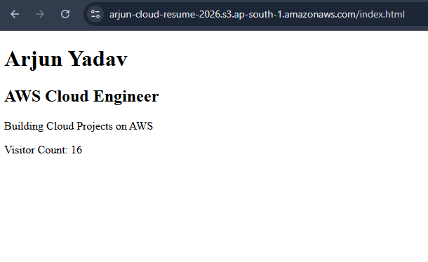
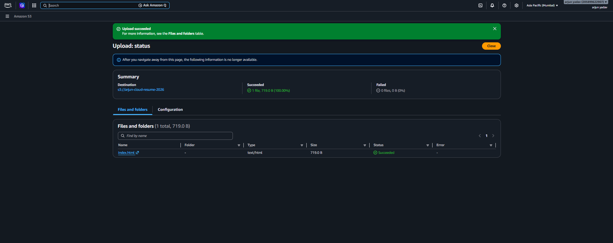
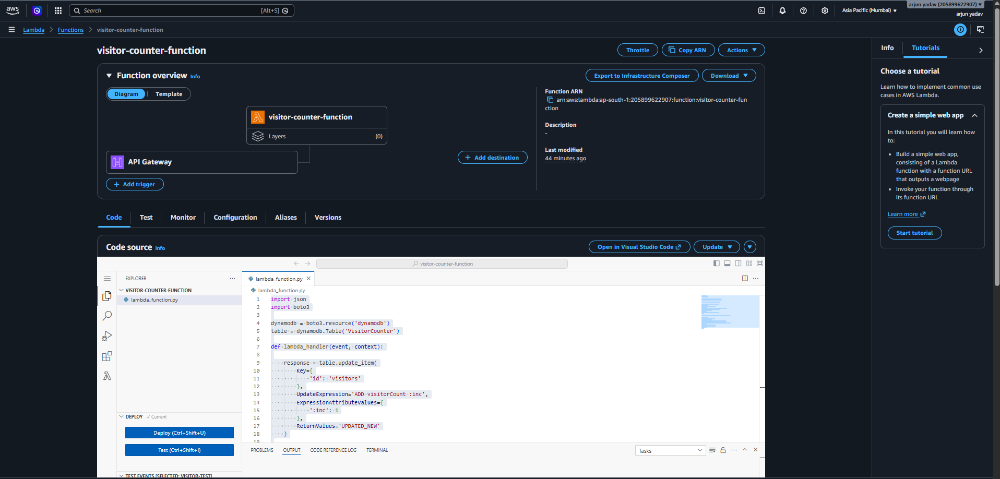
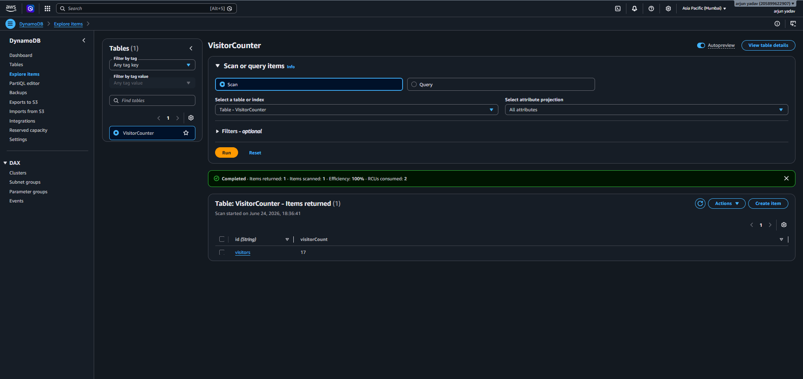
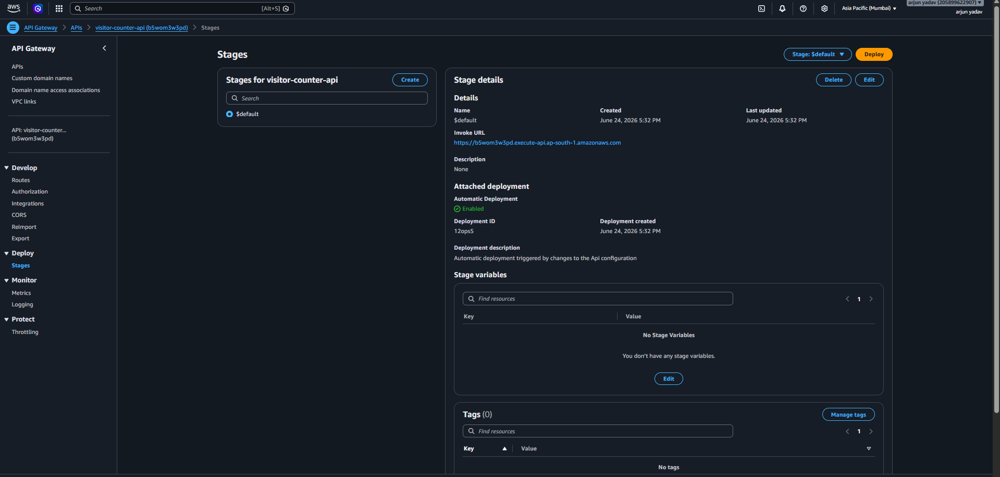
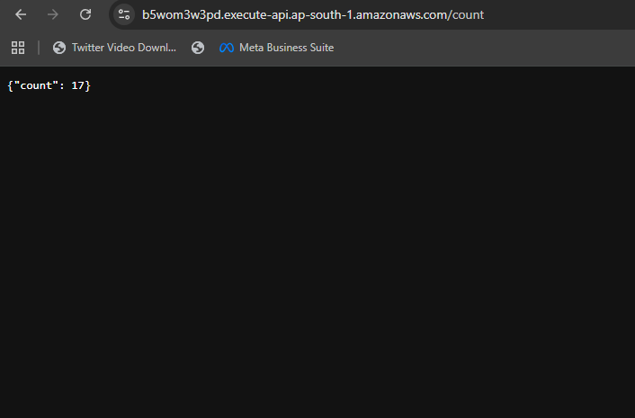

# CloudSight Visitor Analytics

A serverless visitor analytics platform built on AWS that tracks website visits in real-time using Amazon S3, API Gateway, AWS Lambda, and DynamoDB.

## Project Overview

This project demonstrates a complete serverless architecture on AWS.

When a visitor opens the website:

1. Website is hosted on Amazon S3
2. API Gateway receives the request
3. AWS Lambda processes the request
4. DynamoDB stores and updates visitor count
5. Updated visitor count is displayed on the website

---

## Architecture

```text
Amazon S3
    ↓
API Gateway
    ↓
AWS Lambda
    ↓
DynamoDB
```

## AWS Services Used

- Amazon S3
- API Gateway
- AWS Lambda
- DynamoDB
- IAM

## Features

✅ Static Website Hosting

✅ Real-Time Visitor Counter

✅ Serverless Architecture

✅ AWS Cloud Native Design

✅ Cost Effective & Scalable

---

## Live Demo

### Website

(Add your S3 website URL here)

### API Endpoint

https://b5wom3w3pd.execute-api.ap-south-1.amazonaws.com/count

---

## Screenshots

Screenshots will be added soon.

---

## Author

**Arjun Yadav**

AWS Cloud Engineer
---

## Screenshots

### Website Homepage


### Amazon S3 Static Hosting


### AWS Lambda Function


### DynamoDB Database


### API Gateway


### API Response

